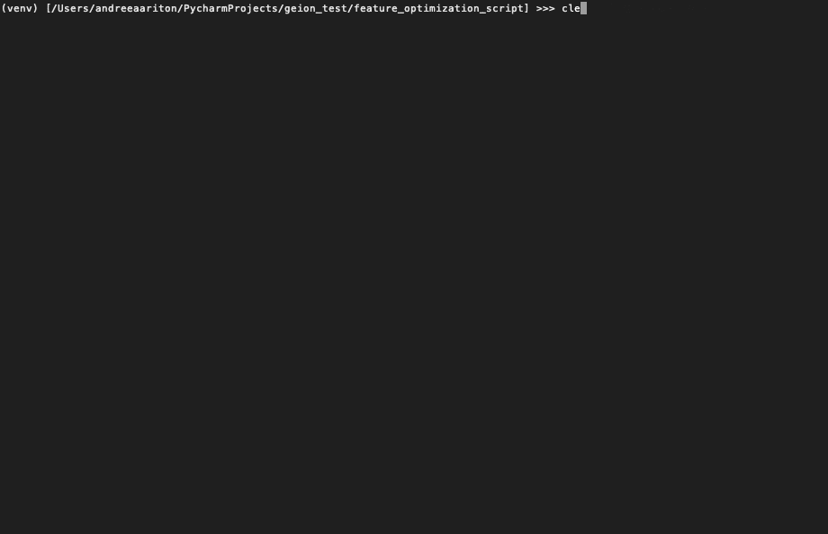

# Geion - Genetic Feature Optimization

A simple toolkit that uses genetic algorithms for automated feature selection and feature optimization.

|  |
| :-: |

Sneak peek demo of using the [FeatureOptimizer](#FeatureOptimizer) on the [Credit Approval Data Set](https://archive.ics.uci.edu/ml/datasets/Credit+Approval) from the [UCI Machine Learning Repository](https://archive.ics.uci.edu/ml/index.php). The FeatureOptimizer is training MLPClassifiers from [scikit-learn](https://scikit-learn.org/stable/). "Baseline" is an [MLPClassifier](https://scikit-learn.org/stable/modules/generated/sklearn.neural_network.MLPClassifier.html) trained alone on the entire dataset, and "XGB Baseline" is the performance of the [GradientBoostingClassifier](https://scikit-learn.org/stable/modules/generated/sklearn.ensemble.GradientBoostingClassifier.html) also trained alone on the entire dataset (included for comparison). All models including those trained by the FeatureOptimizer are being trained and evaluated with 5-fold cross validation. Even after the first generation, the FeatureOptimizer has already yielded a set of features that allow an MLPClassifier to perform with **75%** accuracy, compared to the **69%** baseline where it had been trained on the entire dataset.

# Contents

- [Usage](#Usage)
    - [Information](#Information)
    - [Installation](#Installation)
    - Example code
- [Explanation](#Explanation)
    - Genetic Algorithms
    - Feature optimization with GA
- [Documentation](#Documentation)
    - [FeatureOptimizer](#FeatureOptimizer)
    - [Genome](#Genome)
    - [Individual](#Individual)

# Usage

## Information

Geion is fully capable of Python multiprocessing as the training is built using [Ray](https://github.com/ray-project/ray). This allows for more efficient training and less computation time to reach a solution. 

The toolkit comes with the FeatureOptimizer class that given an sklearn model and training data, will attempt to optimize the data by finding the most relevant features that contribute the most to better model performance for *that* given model. Essentially, it can result in a free accuracy boost for any given model!

## Installation
Geion can be installed via pip, from [PyPi](https://pypi.org/project/geion/0.0.1/) with:

```Bash
python3 -m pip install geion
```

### Requirements

```
python >= 3.6
```

```
sklearn >= 0.0
ray >= 0.8.5
pandas >= 1.0.3
numpy >= 1.18.3
alive-progresss >= 1.5.1
```

## Example

### Some Example Code

```Python
import logging
import warnings

import pandas as pd

from sklearn import preprocessing
from sklearn.model_selection import cross_val_score, train_test_split

from sklearn.neural_network import MLPClassifier  # Importing the model we will use

from geion.genetic.optimizer import FeatureOptimizer  # Importing the FeatureOptimizer from geion
from geion.genetic import Individual  # Wrapper class for sklearn models
from geion.genetic import Genome  # Genome class that will convert data frame into geion genome for use in the GA
from geion.genetic.individual import clip_to_genome  # Utility function that will take a geion Genome and a DataFrame and will clip the DataFrame to the features specified by the Genome

# Starting all the data preprocessing
data = pd.read_csv('./credit_card/crx.data')  # Reading data
data = data.apply(preprocesssing.LabelEncoder().fit_transform)  # Encoding non-numeric values

x_data = data.drop(data.columns[-1], axis=1)  # Target for this dataset is the last column, thus x_data is all but drop last
y_data = data.drop(data.columns[:-1], axis=1)  # Target for this dataset is the last column, thus y_data is drop all but last

x_train, x_test, y_train, y_test = train_test_split(x_data, y_data, train_size=0.7, random_state=42)  # Use 70% of data for training, use seed of 42 so data will always be split the same

# Using the optimizer
optimizer = FeatureOptimizer(20, 0.8, Individual(MLPClassifier, genome=[0, 1], hidden_layer_sizes=len(x_data.columns)), x_train, y_train, x_test, y_test, mutation_rate=1/len(x_data.columns), generation_limit=50, keep_history=True, logging_level=logging.FATAL)

# Initializing FeatureOptimizer with a population of 20 MLPClassifiers, each with hidden features equal to the number of input features; goal accuracy of 80%; dummy genome must be given (will not influence anything); generation_limit of 50; ignore all logging unless fatal
with warnings.catch_warnings(record=True):  # Sklearn models raise ConvergenceWarnings and pollutes terminal, thus silencing warnings
	baseline = MLPClassifier(hidden_layer_size=len(x_data.columns))
	baseline.fit(x_train, y_train)  # Setting up MLPClassifier baseline
	
	base_score = cross_val_score(baseline, x_test, y_test).mean()
	print(f'Baseline: {base_score}')
	
	best_features = optimizer.run_optimizer(parallel=True)  # Using Ray to parallel training on all cores. optimizer will return the best performing genome
	print(best_features)  # Print the best features found

	x_data = clip_to_genome(x_data, genome=Genome(init_genome=best_features.chromosome))  # Clip the training data to only include the best features found
	print(x_data)  # Viewing the new training data for fun with 	only the most optimal features!
```

# Explanation

## Genetic Algorithms

## Feature Optimization with GA

# Documentation

## Genetic

### FeatureOptimizer
```Python
from geion.genetic.optimizer import FeatureOptimizer
```

### Genome
```Python
from geion.genetic import Genome
```

### Individual
```Python
from geion.genetic import Individual
```

## Multicore

