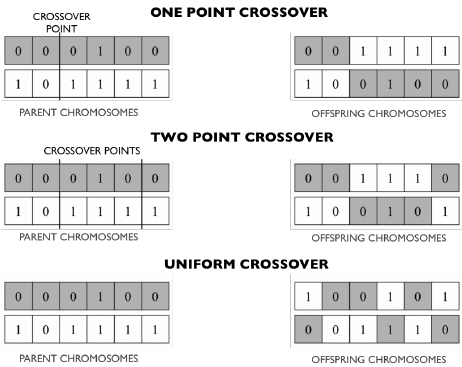

# Geion - Genetic Feature Optimization

A simple toolkit that uses genetic algorithms for automated feature selection and feature optimization.

|  |
| :-: |

Sneak peek demo of using the *[FeatureOptimizer](#FeatureOptimizer)* on the [Credit Approval Data Set](https://archive.ics.uci.edu/ml/datasets/Credit+Approval) from the [UCI Machine Learning Repository](https://archive.ics.uci.edu/ml/index.php). The *FeatureOptimizer* is training MLPClassifiers from [scikit-learn](https://scikit-learn.org/stable/). "Baseline" is an [MLPClassifier](https://scikit-learn.org/stable/modules/generated/sklearn.neural_network.MLPClassifier.html) trained alone on the entire dataset, and "XGB Baseline" is the performance of the [GradientBoostingClassifier](https://scikit-learn.org/stable/modules/generated/sklearn.ensemble.GradientBoostingClassifier.html) also trained alone on the entire dataset (included for comparison). All models including those trained by the *FeatureOptimizer* are being trained and evaluated with 5-fold cross validation. Even after the first generation, the *FeatureOptimizer* has already yielded a set of features that allow an MLPClassifier to perform with **75%** accuracy, compared to the **69%** baseline where it was trained on the entire dataset.

# Contents

- [Usage](#Usage)
    - [Information](#Information)
    - [Installation](#Installation)
        - [Requirements](#Requirements)
    - [Example](#Example)
        - Some Example Code
- [Explanation](#Explanation)
    - Genetic Algorithms
    - Feature optimization with GA
        - Population Creation
        - Fitness Function
        - Assessment
        - Crossover
        - Mutation
- [Documentation](#Documentation)
    - [Genetic](#Genetic)
        - [FeatureOptimizer](#FeatureOptimizer)
        - [Genome](#Genome)
        - [Individual](#Individual)
    - [Multicore](#Multicore)
        - [RayManager](#RayManager)
- Potential Problems and Fixes

</br>

# Usage

## Information

Geion is fully capable of Python multiprocessing as the training is built using [Ray](https://github.com/ray-project/ray). This allows for more efficient training and less computation time to reach a solution. 

The toolkit comes with the *FeatureOptimizer* class that given an sklearn model and training data, will attempt to optimize the data by finding the most relevant features that contribute the most to better model performance for *that* given model. Essentially, it can result in a free accuracy boost for any given model!

Currently, the *FeatureOptimizer* and *Individual* classes support any sklearn model. However the use of using your own custom designed neural networks is encouraged! For any of your own neural networks written in [PyTorch](https://pytorch.org/), have a look at [Skorch](https://skorch.readthedocs.io/en/stable/). Skorch provides sklearn compatible wrappers for PyTorch models which in turn makes them compatible with **geion**!

## Installation
Geion can be installed via pip, from [PyPi](https://pypi.org/project/geion/0.0.1/) with:

```Bash
python3 -m pip install geion
```

### Requirements

```
python >= 3.6
```

```
sklearn >= 0.0
ray >= 0.8.5
pandas >= 1.0.3
numpy >= 1.18.3
alive-progresss >= 1.5.1
```

</br>

## Example

### Some Example Code

```Python
import logging
import warnings

import pandas as pd

from sklearn import preprocessing
from sklearn.model_selection import cross_val_score, train_test_split

from sklearn.neural_network import MLPClassifier  # Importing the model we will use

from geion.genetic.optimizer import FeatureOptimizer  # Importing the FeatureOptimizer from geion
from geion.genetic import Individual  # Wrapper class for sklearn models
from geion.genetic import Genome  # Genome class that will convert data frame into geion genome for use in the GA
from geion.genetic.individual import clip_to_genome  # Utility function that will take a geion Genome and a DataFrame and will clip the DataFrame to the features specified by the Genome

# Starting all the data preprocessing
data = pd.read_csv('./credit_card/crx.data')  # Reading data
data = data.apply(preprocesssing.LabelEncoder().fit_transform)  # Encoding non-numeric values

x_data = data.drop(data.columns[-1], axis=1)  # Target for this dataset is the last column, thus x_data is all but drop last
y_data = data.drop(data.columns[:-1], axis=1)  # Target for this dataset is the last column, thus y_data is drop all but last

x_train, x_test, y_train, y_test = train_test_split(x_data, y_data, train_size=0.7, random_state=42)  # Use 70% of data for training, use seed of 42 so data will always be split the same

# Using the optimizer
optimizer = FeatureOptimizer(20, 0.8, Individual(MLPClassifier, genome=[0, 1], hidden_layer_sizes=len(x_data.columns)), x_train, y_train, x_test, y_test, mutation_rate=1/len(x_data.columns), generation_limit=50, keep_history=True, logging_level=logging.FATAL)

# Initializing FeatureOptimizer with a population of 20 MLPClassifiers, each with hidden features equal to the number of input features; goal accuracy of 80%; dummy genome must be given (will not influence anything); generation_limit of 50; ignore all logging unless fatal
with warnings.catch_warnings(record=True):  # Sklearn models raise ConvergenceWarnings and pollutes terminal, thus silencing warnings
	baseline = MLPClassifier(hidden_layer_size=len(x_data.columns)).
	baseline.fit(x_train, y_train).  # Setting up MLPClassifier baseline
	
	base_score = cross_val_score(baseline, x_test, y_test).mean()
	print(f'Baseline: {base_score}')
	
	best_features = optimizer.run_optimizer(parallel=True)  # Using Ray to parallel training on all cores. optimizer will return the best performing genome
	print(best_features)  # Print the best features found

	x_data = clip_to_genome(x_data, genome=Genome(init_genome=best_features.chromosome))  # Clip the training data to only include the best features found
	print(x_data)  # Viewing the new training data for fun with 	only the most optimal features!
```

</br>

# Explanation

Overview of genetic algorithms and how the *FeatureOptimizer* uses them to select the best features from data.

## Genetic Algorithms

Genetic Algorithms (GAs) are a form of heuristic search based on the Theory of Evolution wherein: 

- A population of individuals exists
    - Each individual carries a genome
    - The best (most fit) of the population are chosen to breed and to create children that proceed to the next generation
    - Occasionally, the genome of an individual/child may randomly mutate one of its genome's features. This aids in maintaining genetic diversity

Eventually after some time, the genetic algorithm will begin to whittle down to sthe best genes that yield the fittest individuals, and will converge on the most optimal solution a the given task.

Thus, a genetic algorithm can be simplified to several steps:

- Population Creation
    - Randomly generate a set of individuals with genomes that represent and pertain to a given task
- Fitness function
    - Creating a "fitness" function that asses the individual's performance on a given task.
- Assessment
    - Assessing and assigning the individuals' performance on the task with the fitness function. Those with the best performance have good genes to solve the problem, thus they breed.
- Crossover
    - Crossover (breeding) is the act of creating a child from two individual's genomes. Often times a popular crossover technique is to take half the genes from one parent and half the genes from the other. Since those with good genes are being bread, in theory only the best genes will be passed down to the child; this is how the optimization works. After all the individuals are paired and create children, the children now replace the older population. This is the second generation, and so forth as the process repeats.
- Mutation
    - Occasionally, there is a chance that one of the child's genes may randomly change. This is called the "mutation rate" (the chance a child has of mutating a gene). This done to maintain genetic diversity, and present new genes even in the later generations.

## Feature Optimization with GA

Applying the principles of genetic algorithms to the feature optimization problem in data is simple and intuitive.

### Population Creation
First, a population of individuals with random genomes must be created. We begin with the task at hand: Finding the optimal features that result in the best performance and understanding of data for a given machine learning model.

If we were to solve this task brute-force, one idea might be to train a model of off some given data and exclude one feature one at a time and assess whether it makes a difference. The process would be repeated for each feature. Therefore in essence, we would be "turning off" a feature at a time.

We can figure out how to *"genomically"* represent our problem by using the idea of "turning off" a feature. If we were to use CSV data, where every column is a different feature, then we can represent a given set of features as whether or not to include that column in the overall training data.

Thus, if we have a list of columns, we can one-hot vectorize the list where a **"1"** would represent "turning on" the column, and using that feature in training; and a **"0"** represents "turning off" the column, therefore not using that feature in training.


The population and will be generated by random one-hot encoded vectors of "on" and "off" genes. These vectors become the genomes of the individuals.

||
| :-: |
| From: [kindsonthegenius](https://www.kindsonthegenius.com/2018/12/14/basics-of-genetic-algorithm-ga-explained-in-simple-terms/) |

### Fitness Function

The fitness function is meant to gauge how well an individual performs at a given task. Since the task in this case is to achieve the best performance (accuracy) of a given ML model on a set of data, the fitness function need be nothing more than simply training the model, and testing how well it performs. Thus, each "Individual" is just a copy of a given model, with the Genome being what features from the data it will accept. 


### Assessment

By training and evaluating an individual, we are evaluating how well the model performs by only learning on the specific features turned on in the *Genome*.

### Crossover

The FeatureOptimizer GA uses random-single-point (one-point) crossover, meaning that out of a list of genes, it will randomly select an index in that list and take all of the genes up to that index from one parent, while taking all of the genes following that index from the other parent.

||
| :-: |
|From: [ResearchGate](https://www.researchgate.net/figure/Illustration-of-examples-of-one-point-two-points-and-uniform-crossover-methods-Adapted_fig5_268525551)|

### Mutation

Mutation is very simple to implement, as in this we just simply randomly select one of th genes, and flip it's value. There is a small percent change that a child will undergo mutation.

</br>

# Documentation

## Genetic

### FeatureOptimizer

```Python
from geion.genetic.optimizer import FeatureOptimizer
```

#### Init

| Args | Type | Description |
| :-:  | :-:  | :-:         |
| ```population_size``` | int | Number of individuals to generate in the population |
| ```target``` | [int, float] | Accuracy to attempt to reach; This is the termination factor |
| ```model```  | Individual | Model to be used for optimization |
| ```x_train``` | pd.DataFrame | X training data |
| ```y_train``` | pd.DataFrame | Y training data |
| ```x_test``` | pd.DataFrame | X testing data |
| ```y_test``` | pd.DataFrame | Y testing data |

| Kwargs | Type | Default | Description |
| :-:  | :-:  | :-:     | :-:         |
| ```generation_limit```| int | 25 | Terminate optimizer after a certain number of generations regardless if target was reached |
| ```mutation_rate```| float | None | Chance of mutation for every child. Default is set to 1/(num of features) inside the optimizer |
| ```elitist_slice``` | float | 0.1 | Percent of the fittest population that automatically proceeds to the next generation without crossover. Deafault is 10%|
| ```periodic_saves``` | bool | False | Save best after every generation |
| ```keep_history``` | bool | False | Keep list of the best performing Genomes from every generation |
| ```print_metrics``` | bool | True | Whether to print generation and stats to stdout |
| ```seed``` | int | False | Seed for the random generation of the population |
| ```use_progresss_bar``` | bool | True | Whether to print the progress bar |
| ```**ray_init_params``` | Dict | None | Optional kwargs that will be given to the RayManager when initializing Ray for training. Recommend at least always passing "logging_level=logging.FATAL" to avoid stdout terminal pollution from Ray workers |

#### Methods

| Method | Kwargs | Type | Default | Description | Returns |
| :-: | :-:  | :-:  | :-:     | :-:         | :-: |
|**run_optimizer()**| ```parallel```| bool | False | Whether or not to use Ray for parallel multiprocessing training. Recommended to always set to **True** unless having issues with Ray | [Genome] Fittest genome |

There are **set_[arg/kwarg]** and **get_[arg/kwarg]** for every arg and kwarg above.

</br>

</br>

### Genome

```Python
from geion.genetic import Genome
```

#### Init

| Kwargs | Type | Default | Description |
| :-:  | :-:  | :-:     | :-:         |
| ```data```| pd.DataFrame | None | Input data to create random one-hot feature representation from |
| ```init_genome```| [Genome, List] | None | Ignore random genome initialization; Will instantiate the new genome to be identical to the given genome. Also can use given one-hot encoded list |

#### Attributes

| Attribute | Type | Description |
| :-:  | :-:  | :-:         |
| ```chromosome```| List | The one-hot encoded column list |


#### Methods

| Method | Args, Kwargs | Type | Default | Description | Returns |
| :-: | :-:  | :-:  | :-:     | :-:      | :-: |
|**set_all()**| ```state```| bool | Arg (must specify) | Will set entire genome to all **0** if given **False**, or all **1** if given **True**| None |
|**is_all()**| ```None```| None | None | Returns **True** if entire genome is **1**; **False** if entire genome is **0**  | [bool] |
|**set_fitness()**| ```fitness```| [int, float] | Arg (must specify) | Sets genome's fitness to given number | None |
|**reset_fitness()**| ```None```| None | None | Sets fitness to **0.0** | None |
|**crossover()**| ```parent2```| Genome | Arg (must specify) | Performs single-point crossover with another Genome | [Genome] self |
|**mutate()**| ```None```| None | None | Randomly mutates one of the genome's genes | [Genome] self |
| **get\_mapping_matrix()** | ```None```| None | None | Return corresponding one-hot vector to DataFrame columns  | Dict |

#### Example Usage:

```Python
from geion.genetic import Genome

genome = Genome(data=my_data)  # Some pandas DataFrame

print(genome.chromosome)
> "[0, 1, 0, 0, 0, 1, 1, 1, 0, 1]"


existing_genome = [0, 1, 0, 1]
genome = Genome(init_genome=existing_genome)  # Using an existing genome or one-hot list

print(genome.chromosome)
> "[0, 1, 0, 1]"
```

</br>

</br>

### Individual

##### Individual inherits from "[Genome](#Genome)" class


```Python
from geion.genetic import Individual
```

#### Init

| Args | Type | Default | Description |
| :-:  | :-:  | :-:     | :-:         |
| ```model```| Any | Arg (must specify) | The sklearn model class **(not instance)** to use |

| Kwargs | Type | Default | Description |
| :-:  | :-:  | :-:     | :-:         |
| ```genome```| [Genome, List] | None | The Individual's genome |
| ```**model_kwargs```| Dict | None | Set of kwargs to be passed to the Sklearn model when instantiated |


#### Methods

| Method | Args, Kwargs | Type | Default | Description | Returns |
| :-: | :-:  | :-:  | :-:     | :-:      | :-: |
|**re_init()**| ```None```| None | None | Will re-initialize the sklearn model | [Individual] self |
|**get\_model_class()**| ```None```| None | None | Returns the sklearn model class originally passed into the init | Any |
|**get\_model_kwargs()**| ```None```| None | None | Returns the sklearn model initialization kwargs originally passed into the init | Dict |
|**get_model()**| ```None```| None | None | Returns the instance of the instantiated sklearn model | Any|
|**get_genome**| ```None```| None | None | Returns Individual's genome | Genome |
|**get_fitness**| ```None```| None | None | Returns Individual's fitness | float |
|**fit()**| ```x_train, y_train```| Args (must specify) | None | Trains the Individual's model using it's own **fit** method | None |
|**cross\_val_fit()**| ```x_train, y_train```| Args (must specify) | None | Trains the Individual's model using 5-fold cross validation | None |
|**cross\_val_score()**| ```x_test, y_test```| Args (must specify) | None | Returns the 5-fold cross validation score of the model | float |
|**average_score()**| ```x_test, y_test, iterations```| Args (must specify), iteration is Kwarg | 5 | Computes the cross\_val_score of the model computed as many times as **iterations**. All of the results are then averaged and returned | float |
|**score()**| ```x_test, y_test```| Args (must specify) | None | Returns the **(correct)/(total)** accuracy of the model | float |
|**crossover()**| ```parent2```| Args (must specify) | None | Inherited from [Genome](#Genome) except returns Individual with automatically initialized crossed-over child genome | float |
|**mutate()**| ```None```| None | None | Inherited from [Genome](#Genome) except returns Individual with automatically initialized mutated genome | Individual |

#### Example Usage

```Python
from geion.genetic import Individual
from sklearn.ensemble import RandomForestClassifier

# Initializing RandomForest Individual with 125 estimators and a random Genome
individual = Individual(RandomForestClassifier, Genome(data=my_data), n_estimators=125)  # Some pandas DataFrame
```

**IMPORTANT!** When creating an *Individual* for the *FeatureOptimizer*, you must initialize with a dummy *Genome* (can be any genome). The dummy genome does not have an impact on the feature optimization and only exists to bypass the *ValueError* raised by the Individual **\_\_init__** when genome is **None**. The dummy genome will be overridden by the actual genomes the FeatureOptimizer will generate correctly off of data. This will be fixed in the future.

</br>

</br>


## Multicore

### RayManager

The RayManager is a simple context manager for Ray. It essentially wraps **ray.init()** and **ray.shutdown()** as you enter and exit the manager. You can specify all of the kwargs as you would in **ray.init()** when instantiating the manager, and it will initialize Ray with those parameters.

```Python
from geion.multicore import RayManager

with RayManager():  # Your kwargs in here
	...
	# Do some work

```

</br>

## Potential Problems and Fixes

#### Accuracy is not improving!

- **Your model may be under powered.** The model must be strong/sophisticated enough to grasp a decent understanding of the data.
- **All the data may be important.** Geion is meant to squeeze out any uninportant features within the data however that doesn't mean there always is some. If all of your features are important, or there are very little features to begin with, then removing any will not necessarily improve a model's performance
- **Run a large enough population.** In order to maintain enough genetic diversity to potentially carry successful genes, a large enough population will need to be used. The more features you have, the larger the genome. The more genes you have, the larger of a population will be required.